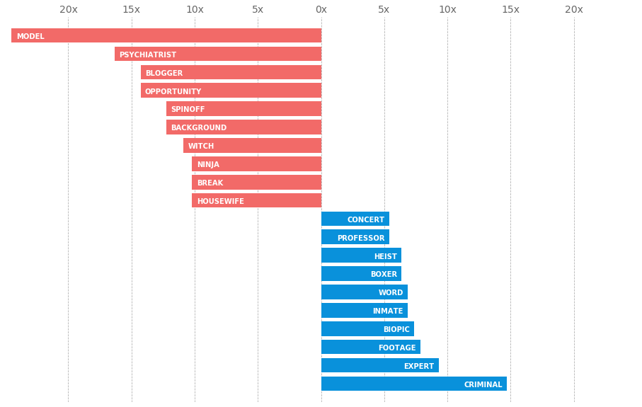
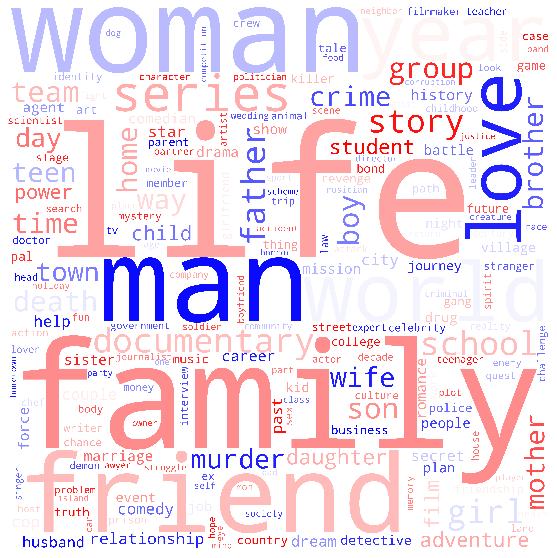
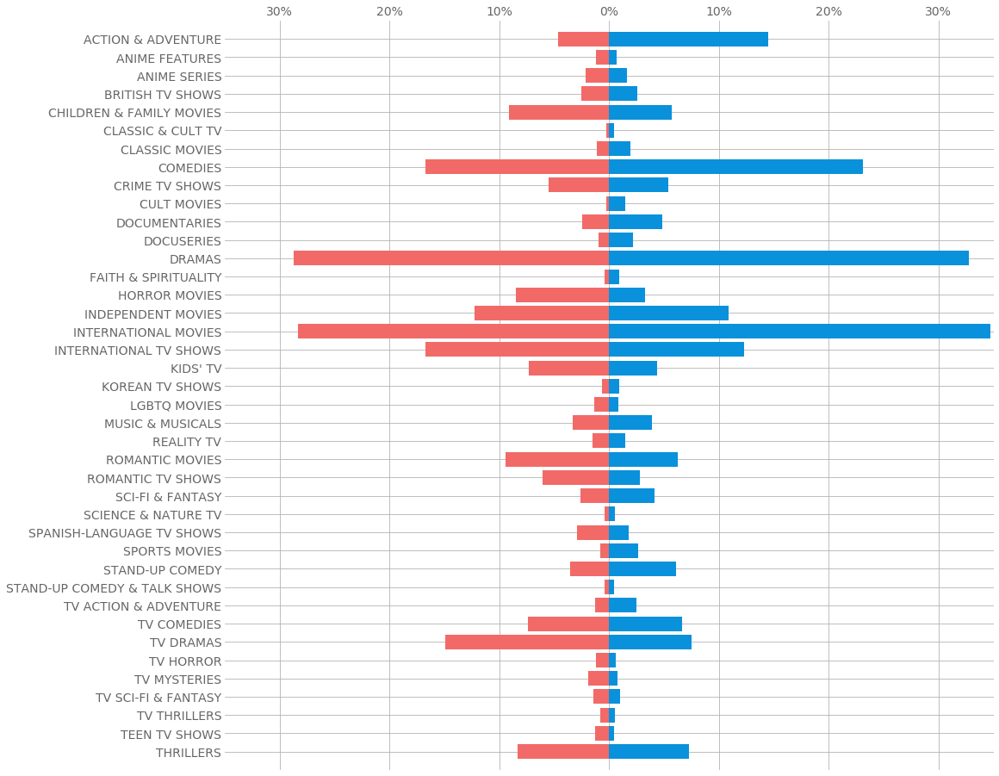

# Netflix-Gender-Exploration
This project takes the Flixable dataset and gathers the genders of each movies' cast using one of IMDb's public datasets to explore gender in Netflix's selection of movies and tv shows.

Netflix data is from the third-party Netflix collection search engine. It provides details of all the movies and tv shows available on Netflix as of 2019. Flixable dataset is available in the repo and on kaggle here: https://www.kaggle.com/shivamb/netflix-shows

The names data is from IMDb's public datasets, and it lists all registered actors, actresses, writers and more along with their titles. IMDb dataset is too large to upload to the repo, so you can get it here (names.basics.tsv.gz): https://datasets.imdbws.com/

I combined these two datasets to find the genders of the casts of each title, and used SpaCy's language model to analyze the words in the descriptions of the movies and tv shows to see if it could bring any insights into gender representation in Netflix movies.

I made three types of plots: a word cloud for nouns and verbs in overall descriptions, a horizontal bar chart displaying likelihoods of certain words being used in a description of a movie or show with a leading gender of a certain role, and a horizontal bar chart showing the percentage of movies/shows of a certain gender that were tagged with a certain genre. I left one of each below as a preview.

